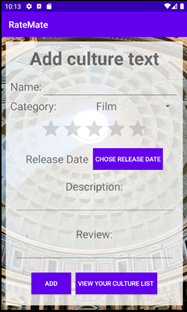
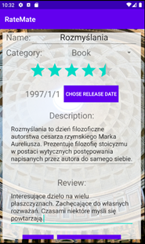
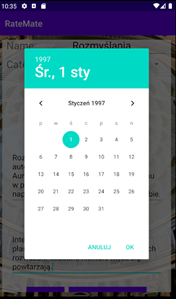
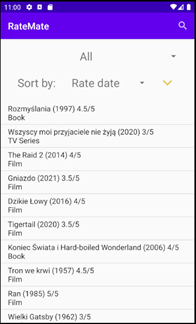
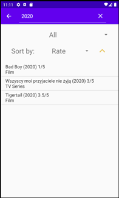
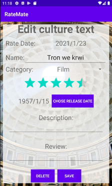
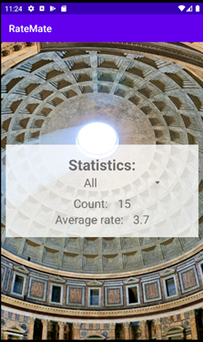

# RateMate - culture texts rating app


## Table of contents
* [General info](#general-info)
* [Screen shots](#screen-schots)
* [Technologies](#technologies)
* [Setup](#setup)
* [Features](#features)

## General info

The application, called "Rate Mate", is used to rate the works of culture that the user has seen. The user adds to the application various movies, books, games, etc. that he has watched / read / played and gives them a rating, and possibly add a description of the work and its reviews. The application allows you to view, filter and sort the added items. Additionally, you can display simple statistics in the form of the number of all watched works and their average rating, as well as statistics in individual categories, e.g. films.
	
To implement the application, I used a database in which data entered by the user is stored.

The main inspiration for the creation of this application were such websites as [IMDB](https://www.imdb.com/), [Filmweb](https://www.filmweb.pl/), [MAL](https://myanimelist.net/) but in local, diary-like way.

## Features
### Main Menu
After starting the application, the user is presented with the main screen presented in the photo below.


From this screen, the user has access to three main functionalities. Each button opens a new activity and takes the user to it:
•	Adding new culture text – ADD NEW,
•	View a list of your culture texts – VIEW YOUR CULTURE LIST,
•	View user statistics – VIEW STATISTICS.

### Adding new culture text
Adding a new text is presented in the three nextphotos.


  




As shown in the first picture the user enters the name of the culture text, selects the text categories from the drop-down list and provides the date of publication using the button that opens the calendar (third photo). Then the user can enter a description of the text and a short review. Importantly, the only mandatory fields to be filled in are the name and the date of issue.

This activity is based on the layout type "ScrollView". It consists in the fact that the user can scroll the screen like a browser on a mobile device. Thanks to this solution, the entered description and review do not "curl" in their own text fields, but only expand the view that can be scrolled, which makes the screen more transparent.

There are two buttons at the bottom of the screen: ADD - to add an item that the user has entered and VIEW YOUR CULTURE LIST - to display the list of user texts. After pressing the ADD button, a message appears whether the item was added to the list or not.


### View culture texts list
Displaying the list of cultural texts is presented in the next two pictures.





The user can see the texts he has added here in the form of a list created with "ListView". Additionally, you can organize the list display by:

1. Search (magnifying glass button in the upper right corner) by name, category, release year, etc.
2. Displaying categories (using the upper "Spinner" - drop-down list), eg movie, book
3. Sorting (using the second "Spinner" and the arrow next to the ascending or descending sort):
	1. Alphabetically
	2. Date of adding the entry
	3. Release date
	4. Rate

### Editing culture text
Editing the list of cultural texts is presented in the next picture and it consists in selecting a text by clicking on it from the level of the culture texts list view.



This view is a modified version of adding a new item. In addition to the information that the user is editing items now, the date of adding the item has been added. The buttons at the bottom have also been modified. These are now DELETE and SAVE buttons. DELETE is used to delete the selected record and SAVE to save changes to the item. After clicking each of these buttons, the user is redirected to the culture texts list view. 

### Statistics
 


This activity allows you to display statistics for specific text categories or aggregate statistics. You can see the number of items added and their average rating given by the user.

## Technologies
Project is created with:
* Android studio 4.0.1
* SQlite Database (build-in android)

## Setup
### Instalation
To run this project, clone this repository and import into Android Studio
```
$ git clone git@github.com:Turandor/RateMate.git
```
### Generating signed APK
From Android Studio:
1. ***Build*** menu
2. ***Generate Signed APK...***
3. Fill in the keystore information *(you only need to do this once manually and then let Android Studio remember it)*


