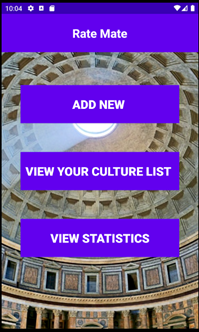

# RateMate - culture texts rating app


## Table of contents
* [General info](#general-info)
* [Screen shots](#screen-schots)
* [Technologies](#technologies)
* [Setup](#setup)
* [Features](#features)

## General info
Application that allows the user to save, rate and review cultural texts. The main inspiration for the creation of this application were such websites as [IMDB](https://www.imdb.com/), [Filmweb](https://www.filmweb.pl/), [MAL](https://myanimelist.net/) but in local, diary-like way.

Aplikacja nazwana „Rate Mate”, służy do oceniania dzieł kultury, które widział użytkownik. Działa w oparciu o bazę danych. Użytkownik dodaje do aplikacji różne filmy, książki, gry itp. które obejrzał/przeczytał/zagrał i wystawia im ocenę oraz ewentualnie może dodać opis dzieła oraz jego recenzje. Aplikacja pozwala na przeglądanie, filtrowanie i sortowanie dodanych pozycji. Dodatkowo można wyświetlać proste statystyki w postaci ilości wszystkich obejrzanych dzieł i ich średniej oceny, a także statystyki w poszczególnych kategoriach np. filmów.
	Do realizacji aplikacji użyłem bazy danych w której przechowywane są dane wprowadzone przez użytkownika.

## Features
a.	Menu główne
Po włączeniu aplikacji ukazuje się użytkownikowi ekran główny zaprezentowany na zdj. 1. 


## Technologies
Project is created with:
* Android studio 4.0.1
* SQlite Database (build-in android)

## Setup
### Instalation
To run this project, clone this repository and import into Android Studio
```
$ git clone git@github.com:Turandor/RateMate.git
```
### Generating signed APK
From Android Studio:
1. ***Build*** menu
2. ***Generate Signed APK...***
3. Fill in the keystore information *(you only need to do this once manually and then let Android Studio remember it)*


